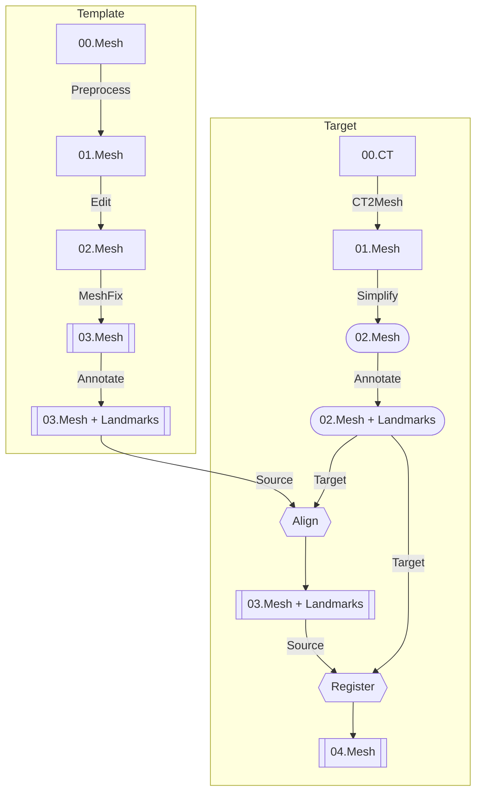

# SCULPTOR

## Registration

```mermaid
flowchart
  subgraph Template
    S00[00.Mesh]
    S01[01.Mesh]
    S02[02.Mesh]
    S03[[03.Mesh]]
    S03L[[03.Mesh + Landmarks]]
  end
  subgraph Target
    T00[00.CT]
    T01[01.Mesh]
    T02([02.Mesh])
    T02L([02.Mesh + Landmarks])
    A{{Align}}
    T03L[[03.Mesh + Landmarks]]
    R{{Register}}
    T04[[04.Mesh]]
  end
  S00 --> |Preprocess| S01
  S01 --> |Edit| S02
  S02 --> |MeshFix| S03
  S03 --> |Annotate| S03L
  T00 --> |CT2Mesh| T01
  T01 --> |Simplify| T02
  T02 --> |Annotate| T02L
  S03L --> |Source| A
  T02L --> |Target| A
  A --> T03L
  T03L --> |Source| R
  T02L --> |Target| R
  R --> T04
```
