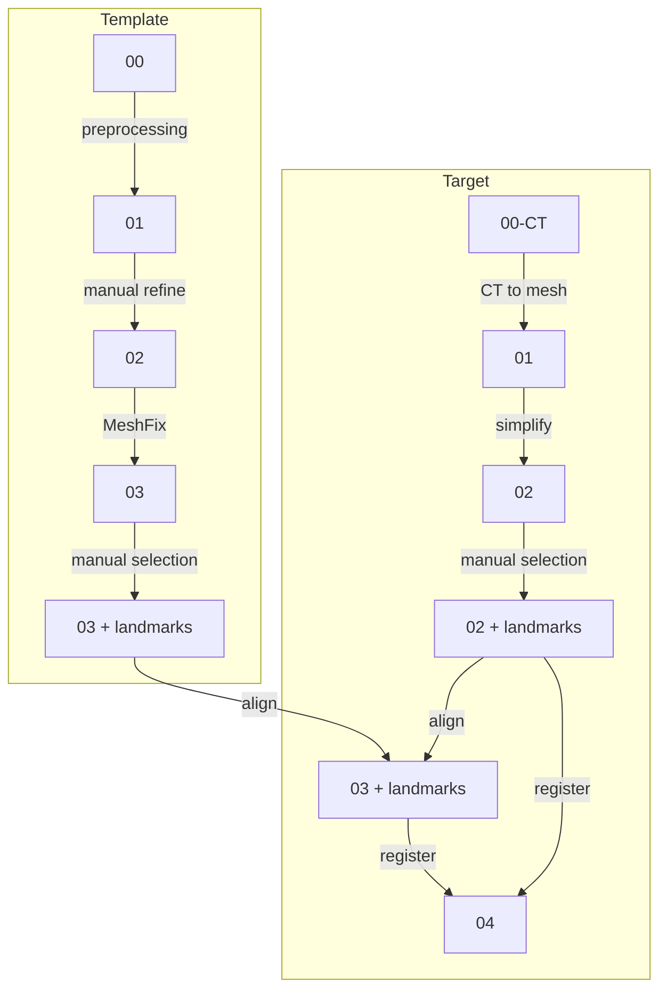

# SCULPTOR

## Pre-Processing

```mermaid
flowchart TD
  subgraph Template
    S0[00]
    S1[01]
    S2[02]
    S3[03]
    S3S[03 + landmarks]
    S0 -->|preprocessing| S1 -->|manual refine| S2 -->|MeshFix| S3
    S3 -->|manual selection| S3S
  end
  subgraph Target
    T0[00-CT]
    T1[01]
    T2[02]
    T2S[02 + landmarks]
    T3S[03 + landmarks]
    T4[04]
    T0 -->|CT to mesh| T1 -->|simplify| T2 -->|manual selection| T2S
    S3S & T2S -->|align| T3S
    T3S & T2S -->|register| T4
  end
```
